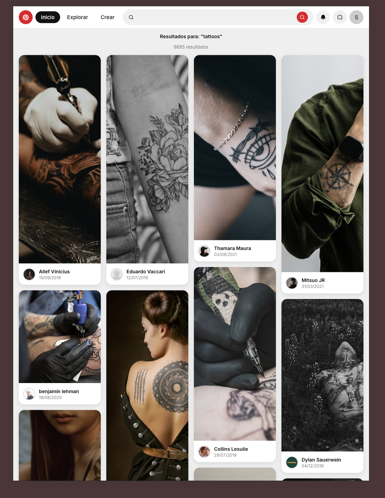

# Pinterest Async

Replica de la red social Pinterest utilizando Vanilla JS, CSS y la API de Unsplash.

## Características

- Esta web busca imágenes en Unsplash.
- Su diseño es moderno.
- Su estructura está formada por componentes divididos en módulos (Header, Gallery, Card, Footer).
- Accesibilidad: navegación por teclado, aria-labels, mensajes claros y concisos.
- Sin frameworks.

## Tecnologías

- JavaScript (Vanilla).
- HTML.
- CSS moderno (variables, responsive).
- Vite.
- API de Unsplash.
- ESLint y Prettier para mantener el código limpio
- Puedes hacer build para producción con:
  ```sh
  npm run build
  ```
  Y servir la carpeta `dist` en cualquier hosting estático (como Netlify).

## ¿Cómo se prueba?

> Recomendado: usa un navegador moderno como Chrome, Firefox, Edge o Safari para la mejor experiencia.
> Necesitas tener Node.js instalado (v18 o superior recomendado).

1. Clona este repo:
   ```sh
   git clone https://github.com/tu-usuario/pinterst-asyn.git
   cd pinterst-asyn
   ```
2. Instala las dependencias:
   ```sh
   npm install
   ```
3. Crea un archivo `.env` en la raíz y pon tu clave de Unsplash (sin comillas ni espacios):
   ```
   VITE_ACCESS_KEY=tu_clave_de_unsplash
   ```
4. Arranca el servidor:
   ```sh
   npm run dev
   ```
5. Abre [http://localhost:5173](http://localhost:5173) ¡listo!

## Demo en vivo

Aquí tienes el enlace:
[Ver demo aquí](https://dreamy-lebkuchen-b71410.netlify.app/).

## Cosas a saber

- El código es sencillo y conciso.
- Todo el DOM se hace con createElement.
- Puedes navegar con el teclado por toda la app (accesibilidad real).
- Si la API de Unsplash falla o llegas al límite, verás un mensaje de error.
- El diseño se adapta a móvil, tablet y escritorio.
- Si quieres cambiar colores: `src/style.css`.

## Mejoras futuras

- Añadir login y favoritos para guardar imágenes que te gusten.
- Guardar búsquedas recientes para acceder rápido a tus temas favoritos.
- Permitir cambiar entre modo oscuro y claro según la preferencia del usuario.
- Mejorar la accesibilidad aún más (por ejemplo, soporte para lectores de pantalla).
- Añadir animaciones suaves al cargar imágenes.
- ¿Tienes una idea? ¡Puedes proponerla abriendo un issue o un pull request!

## Preguntas frecuentes (FAQ)

**¿Por qué no veo imágenes?**

- Lo más seguro es que falte la clave de Unsplash en el archivo `.env`. ¡Sin ella solo se verá un error!

**¿Puedo usar esto para mi propio proyecto?**

- ¡Por supuesto! Hazle los cambios que quieras, es publico.

**¿Cómo funciona Netlify?**

1. Sube tu repo a GitHub.
2. Entra a [Netlify](https://netlify.com), conecta el repo y elige el proyecto que quieres desplegar.
3. Si no aparece de forma automática, donde pone "Build command" pon: `npm run build` y en "Publish directory": `dist`.
4. Añade la contraseña `VITE_ACCESS_KEY` en las variables de entorno del proyecto.
5. Dale a deploy y espera unos segundos.
6. Si aparece algún tipo de error revisa los pasos anteriores y vuelve a desplegar. ¡A VECES PUEDE FALLAR!

## Limitaciones conocidas

- Si haces muchas búsquedas seguidas, se llega al límite gratuito de la API Unsplash y dejará de cargar imágenes temporalmente.
- Lo mismo ocurre en Netlify con las peticiones por día.
- Se necesita conexión a internet para que funcione.

## ¿Tienes un problema o sugerencia?

Si encuentras un bug o una idea para mejorar la app, abre un issue en el repositorio o deja un comentario. ¡Toda ayuda y feedback es bienvenido!

## Créditos

- Iconos: [Remix Icon](https://remixicon.com/).
- Fotos: [Unsplash](https://unsplash.com/).
- Fuentes: [Google Fonts - Inter](https://fonts.google.com/specimen/Inter).

## Vista previa

Aquí puedes ver cómo funciona la app:



---


